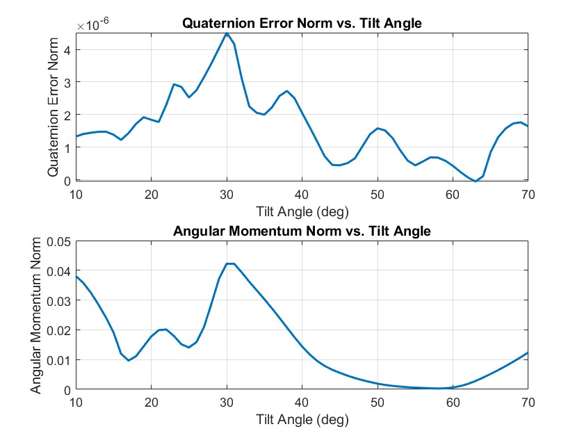
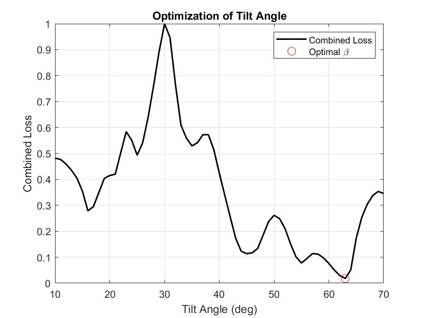

# Reaction Wheel Tilt Angle Optimisation

This repository contains MATLAB/Simulink files and scripts used for the parametric simulation and optimisation of the tilt angle in a 4-wheel pyramidal reaction wheel configuration for spacecraft attitude control.

## Overview

The study investigates how varying the tilt angle of reaction wheels affects two key performance metrics:
- **Pointing Error Norm** – a measure of steady-state pointing accuracy.
- **Angular Momentum Norm** – a measure of control effort and reaction wheel saturation risk.

A multi-objective cost function is constructed using normalized values of both metrics, and an optimal tilt angle is identified by minimizing the weighted loss.

## Example Simulation Setup

### Satellite Inertia

The spacecraft is modeled with a diagonal inertia matrix:

$$
\mathbf{J}_{sat} =
\begin{bmatrix}
10 & 0 & 0 \\
0 & 10 & 0 \\
0 & 0 & 12
\end{bmatrix} \quad \text{(kgm²)}
$$

This represents a nearly symmetric body with slightly greater inertia about the Z-axis.

---

### Reaction Wheel Configuration

- Moment of inertia of each wheel: $J_s = 0.001$ kg·m²  
- Initial wheel speed: $\omega_0 = 0$ rad/s  
- The control allocation matrix is defined as:

$$
A(\beta) = \begin{bmatrix}
\sin(\beta) & 0 & -\sin(\beta) & 0 \\
0 & \sin(\beta) & 0 & -\sin(\beta) \\
\cos(\beta) & \cos(\beta) & \cos(\beta) & \cos(\beta)
\end{bmatrix}
$$

---

### Controller Gains

The absolute attitude controller uses a PD control law with gains:

- $K_p = \mathrm{diag}(10,\ 10,\ 12)$  
- $K_d = \mathrm{diag}(20,\ 20,\ 24)$

---

The following plots show how the two performance metrics vary with tilt angle across the simulation range:

The weighted objective function combines both metrics, guiding the search for an optimal tilt angle.

## Key Features

- MATLAB script to sweep tilt angle (`beta`) across a specified range (10-70 deg).
- Simulink model for spacecraft attitude dynamics and control.
- Evaluation of steady-state pointing error and momentum buildup.
- Optimization framework with adjustable weightings for mission-specific priorities.

## Disclaimer

The results are dependent on the specific control architecture, spacecraft inertia properties, and maneuver profile used in the simulations. This early-stage design study provides directional insights and **should not be used to finalize hardware configuration without further validation**.

